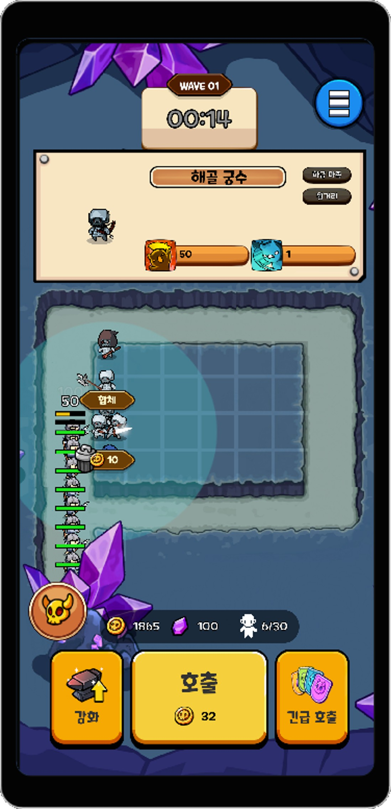
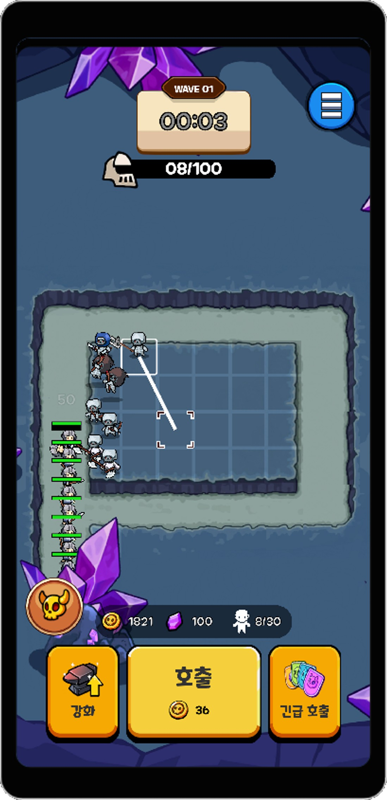
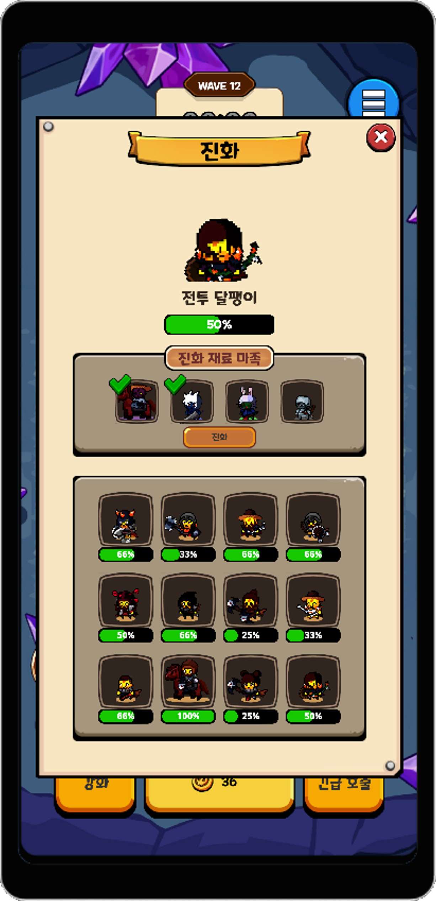

# 🛡️ 구해줘!! 마족마을 (운빨존많겜 모작)

🛠️ **개발 도구**
   

📅 **개발 기간**
25.01-21 ~ 25.02.14 (4주)

랜덤 타워 디팬스 장르의 **운빨존많겜**을 모작한 프로젝트입니다.

**그만쫌쳐들어와**의 리소스를 활용했습니다.

---

## 🛠️ 주요 구현 요소
<table>
  <tr>
    <td align="center"><strong>타워 선택, 합체, 판매</strong></td>
    <td align="center"><strong>타워 이동</strong></td>
    <td align="center"><strong>최상위 타워 진화</strong></td>
  </tr>
  <tr>
    <td></td>
    <td></td>
    <td></td>
  </tr>
</table>

